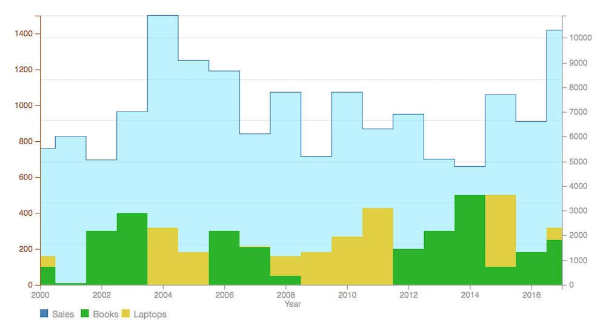
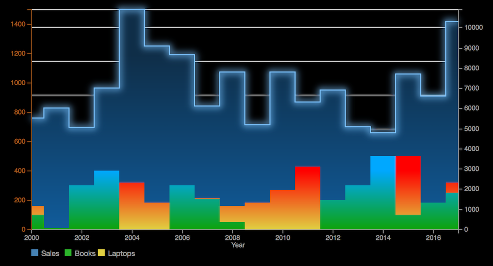

# react with d3

d3 based charts as react components

## Data structure

I'm using similar data structure to Google charts, for example:
```
const data = [
    ['Year', 'Sales', 'Revenue'],
    ['2011', 300, 100],
    ['2012', 180, 10],
    ['2013', 510, 230],
    ['2014', 400, 100],
    ['2015', 1170, 700],
    ['2016', 660, 210],
    ['2017', 1030, 500]
];
```

## Charts






## ToDo

* Line + Dots chart
* Percentage bar chart
* Large data charts
* Chart with dynamically updating data
* Grouped bars chart
* Tooltip (like C3)

## D3 examples

* Zoom
  http://bl.ocks.org/mbostock/431a331294d2b5ddd33f947cf4c81319
* Brush & Zoom
  https://bl.ocks.org/mbostock/34f08d5e11952a80609169b7917d4172
* Brush & Zoom II
  https://bl.ocks.org/mbostock/f48fcdb929a620ed97877e4678ab15e6


## Charts for inspiration

* http://www.anychart.com/products/anychart/gallery/
* https://www.amcharts.com/demos/
* https://www.zingchart.com/gallery/
